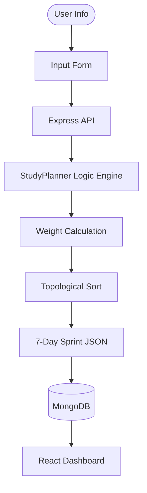

# EduFlow AI: Smart Study Planner for Engineers 🎓🚀

**EduFlow AI** is a sophisticated, AI-driven study planning engine designed specifically for engineering students. It optimizes study schedules by analyzing subject credits, personal confidence levels, and cognitive load to ensure maximum retention and efficiency.
[](https://youtu.be/YnWd4WyIHC4)
[](https://ai-study-planner-u1qg.onrender.com)

## 🌟 Key Features

### 🧠 AI Logic Engine (The "Brain")
- **Adaptive Weighting**: Automatically distributes study hours based on a custom formula: `Weight = (Credits * 1.5) + (InverseConfidence * 2.0)`.
- **Cognitive Load Mapping**: Identifies "High Focus" topics (weak areas) and schedules them strategically to prevent burnout.
- **Sprint-Based Planning**: Generates dynamic 7-day "sprints" that adapt to your weekly availability.
- **Topological Sort**: (Architectural implementation) Ensures prerequisites are mastered before advanced topics are tackled.

### 🎮 Gamified Experience
- **Achievement System**: Unlock badges like *Focus Master*, *Marathoner*, and *Night Owl* as you log study hours.
- **Streak Tracking**: Stay motivated with daily login streaks.
- **Real-time Progress**: Visual dashboards showing daily progress and upcoming milestones.

### 🌓 Modern UI/UX
- **Glassmorphism Design**: A sleek, premium interface built with Tailwind CSS.
- **Interactive Timer**: Integrated study timer to log sessions directly into your history.
- **Responsive Layout**: Works seamlessly across mobile and desktop.

---

## 🛠️ Tech Stack

- **Frontend**: React.js, Tailwind CSS, Lucide Icons, Vite
- **Backend**: Node.js, Express.js
- **Database**: MongoDB Atlas (Mongoose)
- **Authentication**: JWT-free session-based logic (Optimized for Hackathon simplicity)
- **Deployment**: Render (Auto-CI/CD)

---

## ⚡ Quick Start

### Prerequisites
- Node.js (v18+)
- MongoDB Atlas Account

### Local Setup

1. **Clone the Repo**
   ```bash
   git clone https://github.com/riturajjhaba938/AI-Study-Planner.git
   cd AI-Study-Planner
   ```

2. **Install Dependencies**
   ```bash
   npm install
   ```

3. **Configure Environment Variables**
   Create a `.env` file in the root:
   ```env
   MONGODB_URI=your_mongodb_atlas_connection_string
   PORT=5000
   ```

4. **Run Development Server**
   ```bash
   npm run dev
   ```

---

## 📈 Architecture Overview



## 📜 License
Internal hackathon project. Created with ❤️ by **Rituraj Jha**.

---
*Created for the 2026 AI Study Planner Hackathon.*
